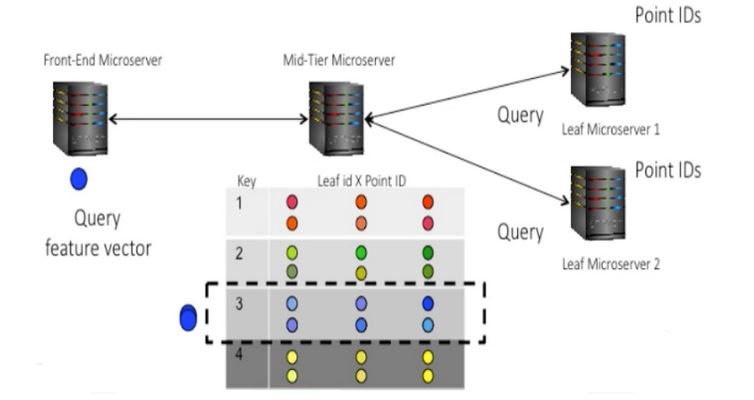
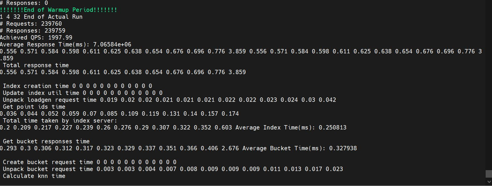
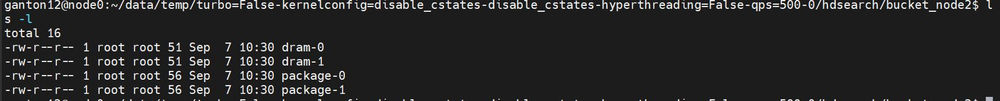

# HDSearch-Multinode

## About HDSearch

HDS benchmarks implements the image searching functionality provided by search engines that enable users to search the web using an image as an input instead of a text query. 

<figure>
  <p align="center"></p>
  <figcaption><p align="center">Figure. High Level Architecture of HDSearch.</p></figcaption>
</figure>

### Client

The user (client-tier) makes a search query using an image as input and expects a response with a list of similar images. For this benchmark, a 2048-dimensional feature vector represented by double numbers has already been extracted using Google’s Inception V3 neural network and saved as pairs of {imageID, feature vector} to be used as the dataset. A subset of this dataset is used as input for the search query that will be sent to the mid-tier.

### Midtier

The query is directed to the mid-tier where it retrieves the feature vectors for this image id that will search for similar images. In a real-life scenario, the mid-tier should check a cache for a recent similar search; if there is a hit, then it returns the feature vector of the image otherwise it has to extract the feature vector using machine learning techniques. This process is not implemented in this benchmark, instead, it assumes always a hit and returns the feature vector.

Mid-tier needs to solve a k-NNs problem efficiently to prune the search space. It uses Locality-Sensitive Hash (LSH) tables, an indexing algorithm that optimally reduces the search space within precise error bounds. The requirement is to distribute the requested vector to as many computational leaves as possible that will be predicted to have a hit.

During an offline index construction step, mid-tier constructs multiple LSH tables for our image corpus. Each LSH table entry contains points that are likely to be near one another in the feature space. On boot up, mid-tier needs to complete the following actions:

* Load dataset from the binary file into a matrix (pairs of image id and feature vector)
* Build an index using Locality Sensitive Hashing (LSH) for num_hash_tables with hash_table_key_length for indexing (BuildLshIndex function at mid_tier_server_helper)
* Transform each hash table into a vector of tables split based on bucket_server number (Leaf) and shard size

During runtime, and upon a query, the mid-tier implements the following algorithm:

For each bucket id (Leaf) {
point_ids_vec = getPointIDs() {
       For each vector/feature of the extracted features from the image {
Apply FLANN
Get indexing key using vector
XOR key to create sub_key
For each hash_table fetch LSH bucket for sub_key
Get all point_ids into point_id_vec
           Save point_id_vec to point_ids_vec(i) where I is each feature of the image
      }
      return point_ids_vec;
}
           Save point_ids_vec vector to point_ids_for_all_bucket_servers array.
           Resize each entry of the array to FIXEDCOMP = 10
}

The above algorithm indicates that mid-tier goes through all LSH tables (one per Leaf, backend server) in order to predict possible hits using FLANN for the provided feature vector. The benchmark uses the FIXEDCOMP constant that is set to 10, which limits the number of features  to 10 per point_id, image, that will be sent to each Leaf. The purpose of this is to limit computations to each Leaf to search for images matching a maximum of 10 features in order to avoid high response variations between the leaves that will affect the final response time to the client.

### Bucket
The benchmarks run with multiple leaf microservices where each leaf microserver compares the query, and feature vectors, against point lists sent by the mid-tier. The computations need to be distributed over many leaves aiming for the computation time and network communication to be  roughly balanced. As the mid-tier microservice latency, and its ability to fan out RPCs quickly, is so critical, the mid-tier microservice and network overheads limit the leaf scalability.

Each leaf computes the 1-NN neighbor for each point id, based on the feature vectors provided by the mid-tier, and if it finds a match it returns it to the mid-tier that will summarize the results from all leafs and returns them to the client.

## Download HDSearch-Multinode
```
git clone https://github.com/georgiantoniou/HDSearch-Multinode.git
```

## Download Profiler
```
cd ./HDSearch-Multinode
git clone https://github.com/georgiantoniou/profiler.git
```

## Change Permission of the Source Code 

```
chmod 777 ./*/*/*
```

## Prepare Source Code
Both repositories have absolute paths so you have to change them with the absolute path under your account.

## Docker Swarm Modules
We map host data to the conteiner using volumes. This data include the necessary dataset and some source code files we modified for the applications. In order to get mapped to the container you must put them under the right host directory which is /mydata/HDSearch(create it if not there). You can get the dataset from this link: https://www.dropbox.com/scl/fi/c1oyomdp4ffhr0hvq3az7/HDSearch-dataset.tgz?rlkey=r1zymqmmks5o4tk8hmybfa4ql&dl=0
And the source code is under the directory ./HDSearch-Multinode/microsuite_files. Copy the files under /mydata/HDSearch and download the dataset
```
cp ./HDSearch-Multinode/microsuite_files/client/* /mydata/HDSearch
cp ./HDSearch-Multinode/microsuite_files/midtier/* /mydata/HDSearch
cp ./HDSearch-Multinode/microsuite_files/bucket/* /mydata/HDSearch
```
Do the above for all three nodes (node0,node1,node2).

## Prepare Host file

Under HDSearch-Multinode there is a file called hosts where we define the nodes on which each process of the benchmark will run on. Modify it to the following:
```
[client]
node0

[midtier]
node1

[bucket]
node2
```

## Distribute Source Code to Nodes and Install Necessary Dependencies
```
./hdsearch-multinode.sh build_install
```

## Configure and Run Experiments
In run_Experiment in the systems_conf structure you can specify whether you want midtier and bucket to have turbo: enabled/disabled, smt: enabled/diabled, c-states: enabled/disabled. The governor is always performance except when you change frequency using the function set_core_freq is userspace. The uncore frequency is at 2GHz (set_uncore_freq).

To run experiment:
```
python3 run_experiment.py BATCH_NAME
```

## Example output

Under your result directory, you should find the following:
* The client file should contanin something similar to the following:
<figure>
  <p align="center"></p>
  <figcaption><p align="center">Figure. Example output HDSearch client.</p></figcaption>
</figure>

* The hdsearch directory should contain measurements for each node(midtier,bucket):
<figure>
  <p align="center"></p>
  <figcaption><p align="center">Figure. Example output Profiler measurements.</p></figcaption>
</figure>

## Building kernel packages on Ubuntu 18.04

```
sudo apt update
sudo apt-get install build-essential linux-source bc kmod cpio flex libncurses5-dev libelf-dev libssl-dev
sudo chmod a+rwx /mydata
wget https://cdn.kernel.org/pub/linux/kernel/v4.x/linux-4.15.18.tar.xz
tar -xf linux-4.15.18.tar.xz
cp /boot/config-4.15.0-159-generic .config
```

Edit .config

```
CONFIG_LOCALVERSION="c1-2-2-c1e-10-20"
CONFIG_SYSTEM_TRUSTED_KEYS=""
```

```
make oldconfig
```

Edit ./drivers/idle/intel_idle.c:661

```
make -j`nproc` bindeb-pkg
```

```
sudo dpkg -i linux-headers-4.15.18-c1-2-2-c1e-10-20_4.15.18-c1-2-2-c1e-10-20-1_amd64.deb linux-image-4.15.18-c1-2-2-c1e-10-20_4.15.18-c1-2-2-c1e-10-20-1_amd64.deb
sudo dpkg -i linux-headers-4.15.18-c1-1-1-c1e-10-20_4.15.18-c1-1-1-c1e-10-20-2_amd64.deb linux-image-4.15.18-c1-1-1-c1e-10-20_4.15.18-c1-1-1-c1e-10-20-2_amd64.deb
sudo dpkg -i linux-headers-4.15.18-c1-1-1-c1e-05-20_4.15.18-c1-1-1-c1e-05-20-3_amd64.deb linux-image-4.15.18-c1-1-1-c1e-05-20_4.15.18-c1-1-1-c1e-05-20-3_amd64.deb
```

## Building kernel tools

```
make -C tools/perf
```

```
sudo apt install pciutils-dev
make -C tools/power/cpupower
```

## Configuring kernel

```
ssh -n node1 'cd ~/mcperf; sudo python3 configure.py -v --kernelconfig=baseline -v'
```

## Setting and checking uncore freq

[Setting uncore freq](https://www.linkedin.com/pulse/manually-setting-uncore-frequency-intel-cpus-johannes-hofmann/)

```
sudo likwid-perfctr -C 0-2 -g CLOCK sleep 1
```

## Socwatch Measurements

### Install SoCwatch


### Run SoCwatch


### Incorporate in HDSearch Run Scripts


## Instructions for Cloudlab 

`Profile:` linux-4-15-18-deb

`Number of nodes:` 3

`OS:` Ubuntu 18.04

`Cluster Type:` c220g5 (skylake)
